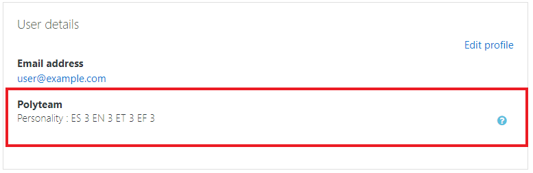

# POLYTEAM

> Moodle plugin for generating teams using personality and affinity groups

## Table of Contents

- [Installation](#installation)
- [Features](#features)
- [FAQ](#faq)
- [License](#license)

---

## Installation

- Find the plugins in the moodle plugin directory
  - [Profile]()
  - [Generator]()
- Install the plugins, You can see this [tutorial]() for the installation process
- Server installation process coming soon...

---

## Features

**Personality type in moodle profile**

**Integrated personality questionnaire block**

**Team generator block**

---

## FAQ

- **How do I do _specifically_ so and so?**
  - No problem! Just do this.

---

## License

- **[MIT license](http://opensource.org/licenses/mit-license.php)**
- Copyright 2015 © <a href="http://fvcproductions.com" target="_blank">FVCproductions</a>.
